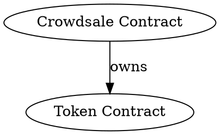
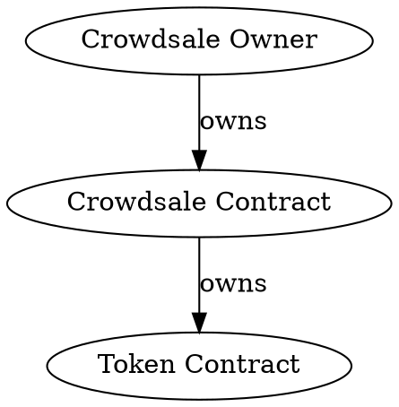
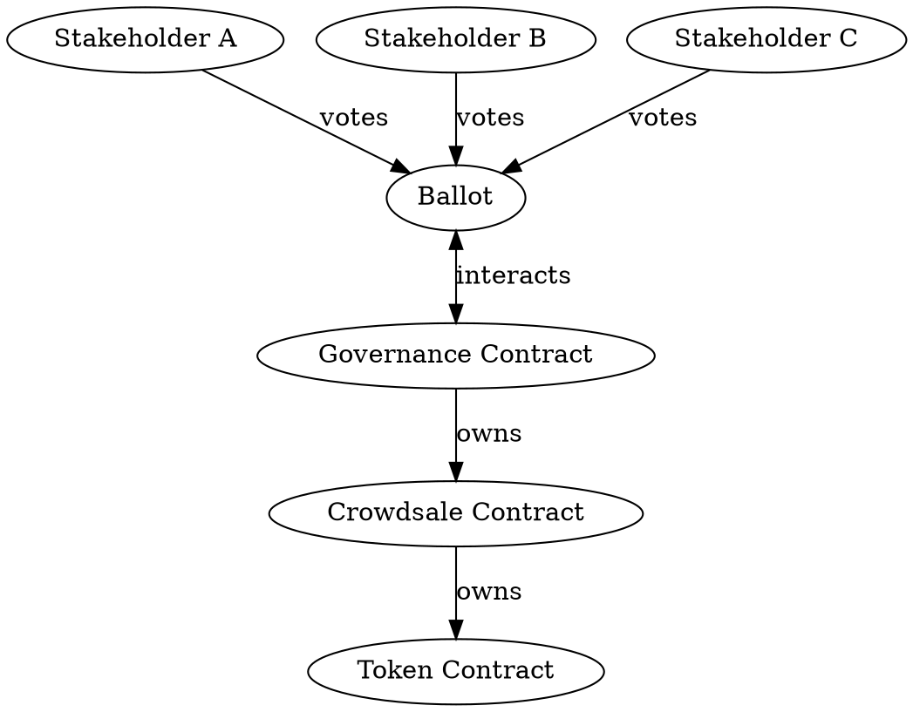

When building your smart contract platform — whether on Ethereum or any other
blockchain — at some you'll be faced with the question of ownership.  In this
article, I will explain three different types of smart contract ownership and
discuss their advantages and disadvantages.

<!--more-->

What is smart contract ownership? Smart contracts and decentralized
applications (DApps) frequently require external input to guarantee continuous
operation. Many of these external inputs and operations require some form of
consensus from the contract stakeholders in order to:

- fix bugs in smart contracts,
- add features to smart contracts,
- allocate dividends for shareholders,
- mint new tokens, or even
- shut down smart contracts.

In more practical terms, we can imagine each of these operations as calling
smart contract functions. To illustrate this, let's imagine a token crowdsale
contract — one of the most popular forms of smart contracts out there, widely
used for ICOs.

([This
article](https://blog.wetrust.io/how-do-token-crowdsales-work-b3b6e9e53800)
explains the mechanisms of token crowdsales.  OpenZeppelin's crowdsale
contract, which can be deployed on the Ethereum blockchain, is described
[here](https://openzeppelin.org/api/docs/crowdsale_Crowdsale.html).)

A token crowdsale has lots of different knobs and settings that you might have
to change while it's running:

- the token cap may be changed;
- bounties can be awarded;
- bonus payouts might be adjusted.

# 1. Ownerless

The simplest option is to make these settings fixed and unchangeable. In that
case, your contract has to be set up correctly from the beginning. It's not
possible to go back and revise options. This also means that once the crowdsale
is set up, token buyers will never have the feeling of investing in a bait and
switch.



The contract code looks roughly like this:

```c
contract Crowdsale {
    ERC20 public token;

    function Crowdsale(ERC20 _token, ...parameters) public {
        token = _token;
        // Copy remaining into crowdsale instance
    }

    function() public {
        // Sell token
        // ...
    }
}
```

The advantage is that this crowdsale contract can not be changed after
deployment.  If an investor decides to buy its tokens, they are guaranteed to
receive the tokens during payout exactly under the same conditions that they
have purchased them under.

There are two risks:

— crowdsale parameters might be misconfigured, potentially leading to unfair
  conditions for certain investors;
- programming errors in the contract code can not be fixed, everything is fixed
  after the crowdsale goes live. If funds are lost, they can not be recovered.

# 2. Single Owner

The next option is to add a single owner to the contract.



The single owner can then change crowdsale parameters, such as bonus payouts or
soft and hard caps. We can then limit the ability to change crowdsale
parameters to the contract owner. By default, this is the address that created
the contract.

If you're basing your contract on OpenZeppelin's
[Ownable](https://openzeppelin.org/api/docs/ownership_Ownable.html),
implementation becomes an easy task. Simply define your smart contract like
so:

```c
contract Crowdsale is Ownable {
    ERC20 public token;

    function Crowdsale(ERC20 _token, ...parameters) public {
        token = _token;
        // Copy remaining into crowdsale instance
    }

    function() public {
        // Sell token
        // ...
    }

    // The owner can now change crowdsale parameters
    function changeAttributeXYZ(XYZ newValue) public onlyOwner {
        value = newValue;
    }
}
```

Having a single owner allows changes to the crowdsale to be done swiftly. This
is useful if urgent action is required. Especially if the crowdsale is
happening in a trusted and closed environment — where all parties know and
trust each other — having a single owner is the best option.

There are some risks to consider as well:

- crowdsale owners can bait and switch investors by changing crowdsale
  parameters after the investment already took place;
— ownership access keys can be lost or stolen, and a malicious actor could
  manipulate the crowdsale.

# 3. Governance

A third option is a governance smart contract. This can typically involve
several shareholders who each own a stake in the governance contract and can
change it based on consensus. The governance contract in turn manages the
crowdsale contract. The stakeholders can be advisors, investors, or founders.



Changes to the crowdsale contract parameters are handled in a very democratic
way. The following steps are required.

1. A stakeholder proposes a change to the crowdsale and creates a ballot. The
   ballot contains code that the governance contract can execute, in this case,
   code that changes crowdsale parameters.
3. Each stakeholder is assigned a number of votes proportionate to their shares
   or other predetermined factors.
3. All stakeholders have an opportunity to vote.
4. Once all eligible voters have voted or the ballot has closed, whichever
   comes first, the ballot is executed.

This process will provide the best possible outcome in terms of openness
and trustworthiness. Making decisions out in the open and letting those with
a vested interest participate in it will show that you are seriously interested
in implementing a democratic and decentralized crowdsale that treats stakeholders
fairly.

In a governance setting, every change in crowdsale parameters will be preceded
by a standardized voting process during which people have the opportunity
to understand and discuss how the changes in the smart contract will affect
their investment.

Even in the most democratic setting, malicious actors can manipulate the
process. Someone owning a lot of votes — by acquiring crowdsale
shares — can significantly influence a ballot's outcome. The owner can even
try to conceal this by owning the shares through many different wallet
addresses. But still, since voting happens out in the open, deliberate fraud
will immediately become obvious.

# 4. Conclusion

To sum it up, there are three different ways to implement contract ownership:

1. ownerless contracts,
2. single-owner contracts, and
3. governance-owned contracts

When implementing your decentralized application on the blockchain, you should
carefully weigh the advantages and disadvantages of each approach and
come to a decision that works best for both for you and your users.
