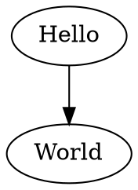

I've taken some time to enhance my blog with two useful features:

- SVG images generates are now embedded into HTML
- Automatic PDF conversion for posts

I will cover how the two have been implemented.

<!--more-->

# SVG Embedding

It all started with trying to turn this piece of coded embedded into my
Markdown posts:

~~~
```
digraph {
  "Hello" -> "World"
}
```
~~~

into this SVG image



Embedding code that generates visualizations into files has always been
incredibly useful. Having text and graphics next to each other makes writing
and editing a blast. For me it is one of the big reasons why I've switched to
Hakyll in the first place. The flexibility in how I create my Markdown files is
incredible, and would be hard to achieve with any other static site generator
framework.

When using Hakyll, updating and creating assets on the fly is a really fragile
procedure. I was basing my code for creating Graphviz and Mscgen assets off of
Jean-Pierre Prunaret's code that I've found on
[GitHub](https://github.com/jpierre03/pandoc-filter-graphviz) some time ago. It
was absolutely not meant to be used with Hakyll, and while after some initial
tweaking it worked fine locally, I was greeted with missing images when
running the Hakyll creation process on CircleCI and then deploying the _dist_
folder to Netlify.

In order to understand what went wrong, we first have to understand how Hakyll
builds sites under ideal circumstances:

1. Hakyll traverses all user specified files and file groups, each declared as
   `match "path/*"` (and also all `create`'d files) and tracks them as
   compilation sources. It also sees if any compilation sources require others
   -- a very powerful feature -- and establishes which to compile first.
2. It applies the specified compile instructions to each source and stuffs the
   result in the correct folder (or `route` in Hakyll).
3. If Hakyll is running in `watch` mode, it waits for any of the routes
   determined in step 1. to change, or have files added inside glob matches,
   and then runs 2. again.

The compilation process is extremely straightforward, and resembles Make.

It also has one problem. While a compilation process is running, it is very
difficult to dynamically add new compilation targets that arise from running
step 1., and then have these compiled and added automatically. If it was
possible to do this, a compilation process like this would typically be called
"1-pass". Users of LaTeX know that using it in certain combinations, for
example with BibTeX, requires a so called 2-pass (or perhaps even 3-pass and so
on) compilation, where each document compilation works on the document a little
bit in order for the next step to do the rest. This typically involves things
like

- finding all labels and references in a file
- determining correct placement of references
- if correct placement was not possible, try recompilation (apparently it is
  possible to trigger an [infinite
  compilation](https://tex.stackexchange.com/questions/81695/avoid-infinite-compiler-passes-with-biblatex-ibid-citation-styles)
  process there)

So here is exactly where the perfect storm arose and made my life hard:

1. Hakyll traverses my posts folder, and finds all the markdown files that I
   want to turn into blog posts.
2. Hakyll compiles a blog post to HTML, and in the process of doing so
   generates all SVG files, inserts the links to them into the Pandoc document
   AST and the compilation is done.
3. Hakyll copies the resulting file in the `dist` folder and calls it a day.

But wait! What about the SVG files that we've just created? Since they are a
result of step 2., Hakyll isn't able to "know" that we've just created them,
and is not able to identify them as resources it needs to copy into the `dist`
folder.

The cheap solution to this problem is exactly what 2-pass TeX would do. Run it
once, and then run it once more. The thing is, I don't really want to mess
around too much with _fragile_ build processes that run on CircleCI, as ideally
I just want to have enough faith in my process, that I can just run `git
commit` and `git push` and have a new post online on my blog in a few minutes.

In hindsight, the solution is quite obvious (as always). When before, the
Pandoc filter that I was using, was creating SVG files on my hard drive, I
could also just instruct Graphviz or Mscgen to just give me the SVG directly
through standard out, and then insert it into the Pandoc AST as raw HTML, a so
called `RawBlock`, and fix the problem for good.

And that is exactly what I did. It is the reason why the SVG image above is not
an `img` tag, but a `svg` tag. Problem solved!

# PDF Conversion

Perhaps you've already noticed it: Every post now offers a link to a PDF
download.

For years now I've been fascinated by the beautiful typesetting capabilities
that LaTeX & TeX offer. And part of that are all the stunning math equations
you can create, but more importantly for me, and for writing prose, is how
LaTeX wraps paragraphs, utilizes ligatures and hyphenates. There is a really
helpful comparison of Microsoft Word, Adobe InDesign and LaTeX
[here](http://www.rtznet.nl/zink/latex.php?lang=en) from 2008. And while the
comparison is old, and Word and InDesign could have improved their paragraph
building meanwhile, the key advantage is that a LaTeX based toolchain can be
completely open source, tweakable, and incredibly flexible.

I don't even want to think about how awful it would be to have to install Adobe
InDesign on my Linux CI environment, let alone Microsoft Word. They most likely
won't just work on my Haskell/Stack docker image without many, many tweaks, and
even after tweaking would still require me to pay a monthly licensing fee.

With Pandoc and Hakyll, and a lot of head-scratching, I was able to put
together something that works, all the time, everywhere. The way it works is
very similar to any other Hakyll compilation, except that in this case I needed
to specify a custom PDF writer that Hakyll did not provide. I've also taken
some time to tweak the default TeX template that Pandoc comes with and removed
parts that I am not using, and added some other parts that might come in handy
for me.

# Closing Words

I invite you to check out the source code for my blog on
[GitHub](https://github.com/justuswilhelm/personal-website/) and give me your
feedback. Of course, you are also invited to try opening the PDF version of
this article by using the link below.

With all these improvisations, it's my goal to make writing posts a pleasant
experience that is tailored to what I want to write about. Perhaps today I've
come one step closer to my goal.
